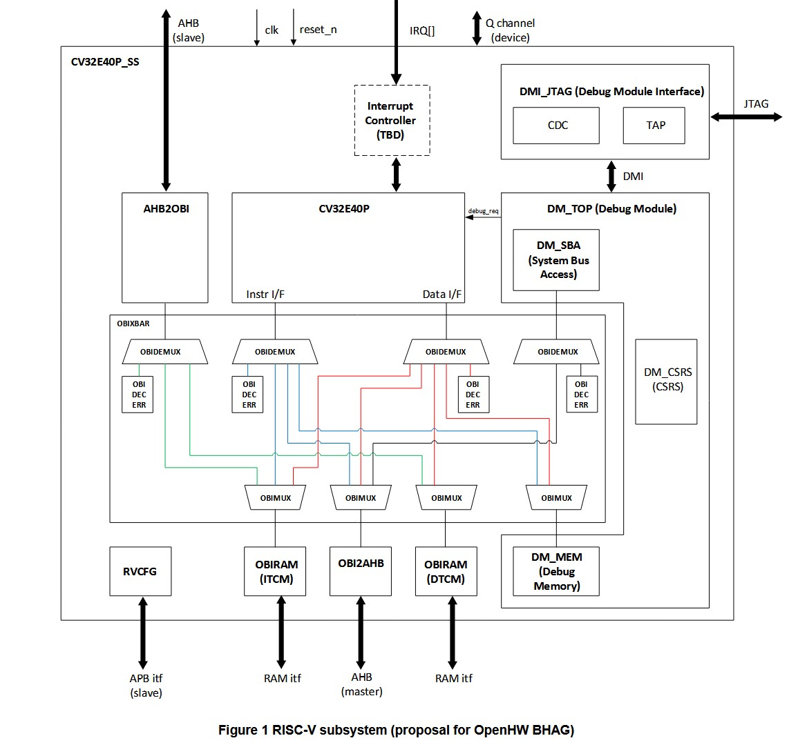
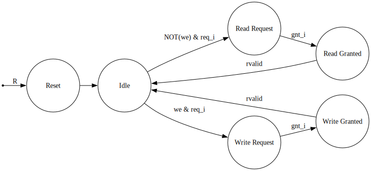

# Obi Master-Slave Implementation Tutorial

OBI BUS protocol Master and Slave sample implementation according to
OBI protocol, version 1.2.

*100% ORGANIC CODE | NOW 100% AI-FREE!*

## What's this?

This is a sample OBI bus implementation according to the OBI 1.2v standard.
The purpose of this repository is to provide quick reference on how to add a
peripheral device to the OBI bus, as well as integrate them into your design.

Contents:

```
├── LICENSE
├── README.md
├── ip                    // IP
...
├── main.sv
├── main_tb.sv
├── obi_master
│   ├── obi_master.sv     // Master DUT
│   └── obi_master_tb.sv  // TB
└── obi_slave
    ├── a.out
    ├── config.json
    ├── mem.hex
    ├── mem_waligned.sv   // Byte-aligned memory
    ├── obi_slave.sv      // Slave DUT
    ├── obi_slave_be.sv
    ├── obi_slave_be_tb.sv
    └── obi_slave_tb.sv

```
Short description: 
- `obi_master.sv` - Master device able to send Read/Write commands.
- `obi_slave.sv` - Slave device able to write and read signals from its SRAM.
- `obi_slave_be.sv` - Slave with byte-enable word-aligned memory (risc-v).
- `*_tb.sv` - Testbenches (Read/Write tests)

Both device files act as templates. They work, but extra (not mandatory) signals for i.e atomic
operations are only implemented as a parameter. This can be implemented as see fit.
Both devices implement limited error handling (e.g bad writes).
The byte enabled version uses word-aligned (RISC-V 4-word rsp) byte enable for read and write operations.

## Adding an OBI Bus Slave Device

Step-by-step:

1. Increment the NumPeriphs Macro in the soc_pkg.sv file to match the # of peripherals in your design.

```
    localparam bit [31:0] FooAddrOffset           = 32'h0000_0000;
    localparam bit [31:0] FooAddrRange            = 32'h0000_000F; 

    localparam bit [31:0] BarAddrOffset            = 32'h2000_0000;
    localparam bit [31:0] BarAddrRange             = 32'h0000_0008; // 256 * 32 bit words

    localparam int unsigned NumPeriphRules  = 2;
    localparam int unsigned NumPeriphs      = NumPeriphRules + 1; // additional OBI error


```
2. Adjust the address ranges of your peripherals. Without this
all of your device signals will be routed to the obi error device, instead.

3. Adjust the Obconfig. Signals/wires are enabled by per paremeter basis. For example, 
you can choose not to use the rready signal. 
```
    localparam obi_pkg::obi_cfg_t SbrObiCfg = '{
          // rready is used
          UseRReady:      1,
          CombGnt:     1'b0,
          AddrWidth:     32,
          DataWidth:     32,
          // One manager
          IdWidth:        1,
          Integrity:   1'b0,
          BeFull:      1'b1,
          OptionalCfg:  '0
      };
```

Optionally, you can create your own OBI struct. All that an OBI mux/demux needs is a struct with matching signal names.

4. Instantiate two OBI buses for your devices: 
one for the A-channel, and the other for the R-channel. 
Tie off signals if desired.

```
    // Error bus
sbr_obi_req_t error_obi_req;
sbr_obi_rsp_t error_obi_rsp;
// Slave 1 bus
sbr_obi_req_t foo_obi_req;
sbr_obi_rsp_t foo_obi_rsp;
 // Slave 2 bus
sbr_obi_req_t bar_obi_req;
sbr_obi_rsp_t bar_obi_rsp;

```

Remember to add appropriate entries for the adress map in main.sv as well.

```
    // ---------------
    // Periph Addr Map
    // ---------------

    assign error_obi_req = all_periph_obi_req[PeriphError];
    assign all_periph_obi_rsp[PeriphError] = error_obi_rsp;

    assign foo_obi_req = all_periph_obi_req[PeriphFoo];
    assign all_periph_obi_rsp[PeriphFoo] = foo_obi_rsp;
    
    assign bar_obi_req = all_periph_obi_req[PeriphBar];
    assign all_periph_obi_rsp[PeriphBar] = bar_obi_rsp;

```

5. Instantiate your device. Map the A/R channels to their respective signals in your IP.

```
       //// A-channel signals
       .obi_req_i (bar_obi_req.req),
       .obi_gnt_o (bar_obi_rsp.gnt),
       .obi_addr_i (bar_obi_req.a.addr),
       .obi_we_i (bar_obi_req.a.we),
       .obi_be_i (bar_obi_req.a.be),
       .obi_wdata_i (bar_obi_req.a.wdata),

        //// R-Channel signals
       .obi_rvalid_o (bar_obi_rsp.rvalid),
       .obi_rready_i (bar_obi_req.rready),
       .obi_rdata_o (bar_obi_rsp.r.rdata),
       .obi_err_o (bar_obi_rsp.r.err)
```
6. (Optional) There are ready-to-use TBs for OBI Interfaces,
if your synthesis tool supports that.

## Adding a (second) Master device

1. Instantiate the Multiplexer
If your design features multiple masters, you must add a mux to each slave and a demux
for each master. Depending on your usecase, you might want to 
use an OBI Xbar instead, if you have multiple slaves and masters in your design.




2. Change the master device macro
You must also change the configuration in the `soc_pkg` file
to match the number of your peripherals/master devices. 

See the Greyhound project for reference.


## State-transition Diagram


Licensed under Apache 2.0 license, see details in `License.txt`.

