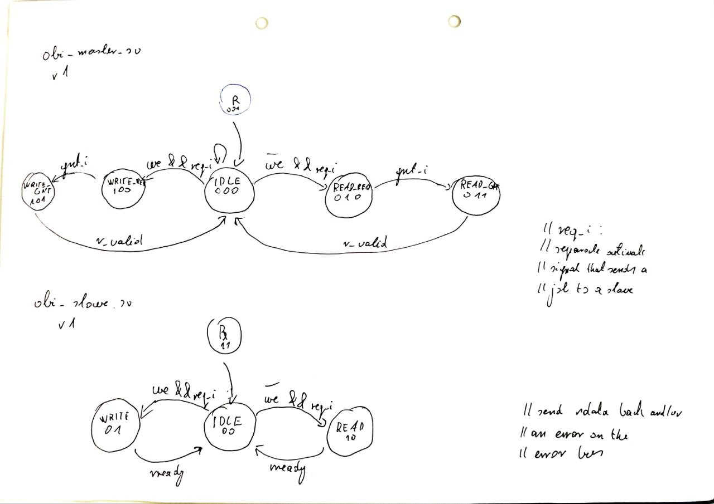

# Obi Master-Slave Implementation
OBI BUS protocol Master and Slave sample implementation according to
OBI protocol, version 1.2.

*100% ORGANIC CODE | NOW 100% AI-FREE!*

Contents:
- `obi_master.sv` - Master device able to send Read/Write commands.
- `obi_slave.sv` - Slave device able to write and read signals from its SRAM.
- `obi_slave_be.sv` - Slave with byte-enable word-aligned memory (risc-v).
- `*_tb.sv` - Testbenches (Read/Write tests)

Both device files act as templates. They work, but extra (not mandatory) signals for i.e atomic
operations are only implemented as a parameter. This can be implemented as see fit.
Both devices implement limited error handling (e.g bad writes).
The byte enabled version uses word-aligned (RISC-V 4-word rsp) byte enable for write operations.

## Adding an OBI Bus Slave Device

Step-by-step:

1. Increment the NumPeriphs Macro in the soc_pkg.sv file to match the # of peripherals in your design.
2. Adjust the Obconfig. Signals/wires are enabled by per paremeter basis. For example, you can choose to
not use the rready signal. 
3. Instantiate OBI buses for your devices. Tie off signals if desired.
4. Adjust the adress map in the soc_pkg file. 

## Adding a (second) Master device
??? TODO
- Instantiate the Multiplexer
- Change the master device macro

## State-transition Diagram

Licensed under Apache 2.0 license, see details in `License.txt`.

